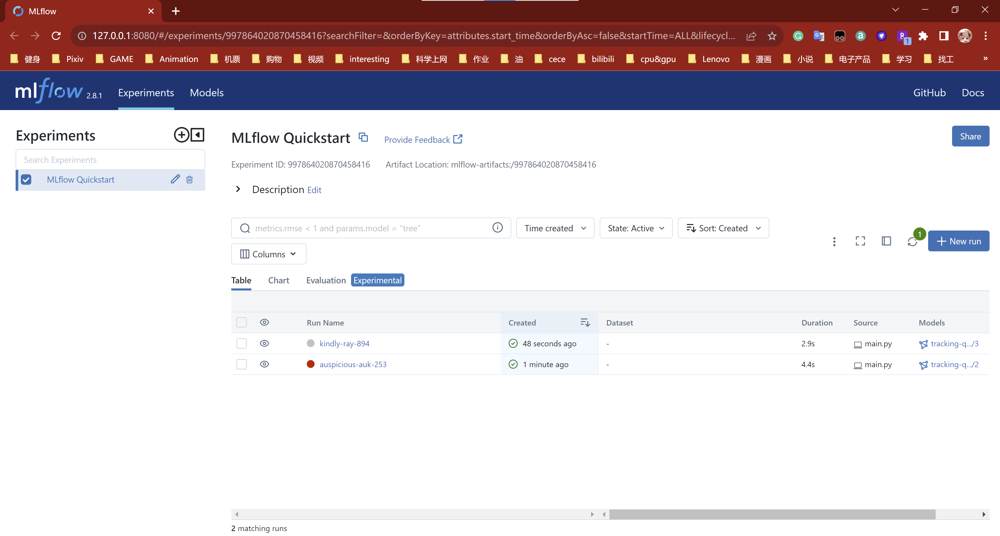
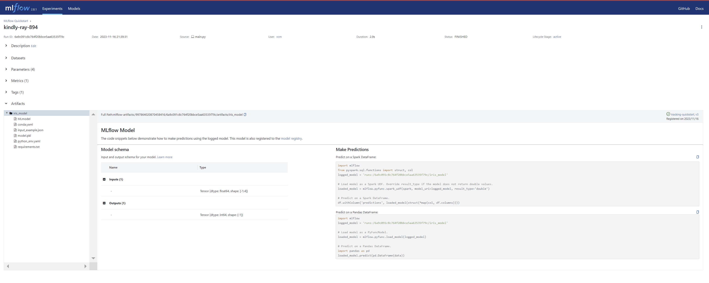

# IDS706_MiniProj12_YangXu: MLflow Project Management

[](https://github.com/nogibjj/IDS706_MiniProj12_YangXu/actions/workflows/cicd.yml)

## Project Overview
This project showcases the creation of a simple machine learning model and the utilization of MLflow to manage the project, including tracking metrics.

## Getting Started

### Prerequisites
- Python 3.7 or later
- Pip package manager

### Installation
Follow these steps to install the required packages and run the MLflow tracking server:
```shell
pip install mlflow
mlflow server --host 127.0.0.1 --port 8080
```

### Model Functionality
A Logistic Regression model has been trained on the Iris dataset with evaluation metrics like accuracy, precision, recall, and F1-score calculated to assess performance.

### MLflow Tracking
MLflow is used to track experiments, log parameters, and register the model. To view metrics and model details, navigate to the MLflow UI at http://127.0.0.1:8080.

#### Main MLflow Tracking Page
Here's the MLflow Tracking main page showing the list of experiments:


#### Detailed Run View Page
Clicking on a specific run provides detailed metrics, parameters, and model artifacts:


## Deliverables
### MLflow Project Directory
The project directory structure is as follows:
```bash
IDS706_MiniProj12_YangXu (Root Directory)
│
├── .devcontainer
│   ├── Dockerfile
│   └── devcontainer.json
│
├── .github
│   └── workflows
│       └── cicd.yml
│
├── main.py
│
├── test_main.py
│
├── requirements.txt
│
├── Makefile
│
├── README.md
│
└── .gitignore
```

### sample output

```bash
2023/11/16 20:30:37 INFO mlflow.tracking.fluent: Experiment with name 'MLflow Quickstart' does not exist. Creating a new experiment.
Successfully registered model 'tracking-quickstart'.
2023/11/16 20:30:45 INFO mlflow.store.model_registry.abstract_store: Waiting up to 300 seconds for model version to finish creation. Model name: tracking-quickstart, version 1
Created version '1' of model 'tracking-quickstart'.
   sepal length (cm)  sepal width (cm)  petal length (cm)  petal width (cm)  actual_class  predicted_class
0                6.1               2.8                4.7               1.2             1                1
1                5.7               3.8                1.7               0.3             0                0
2                7.7               2.6                6.9               2.3             2                2
3                6.0               2.9                4.5               1.5             1                1
```

### Testing
To run tests, execute the test_main.py script using the following command:
```shell
python test_main.py
```
